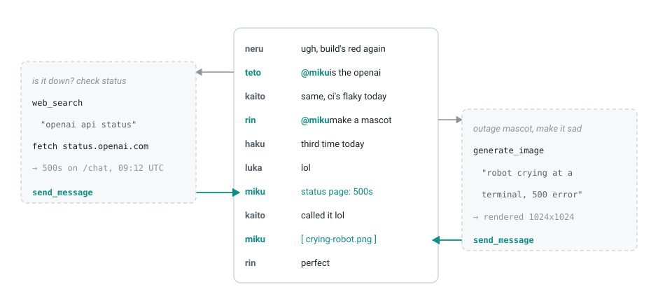
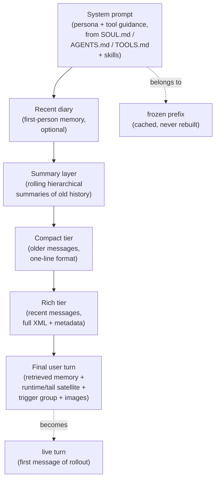
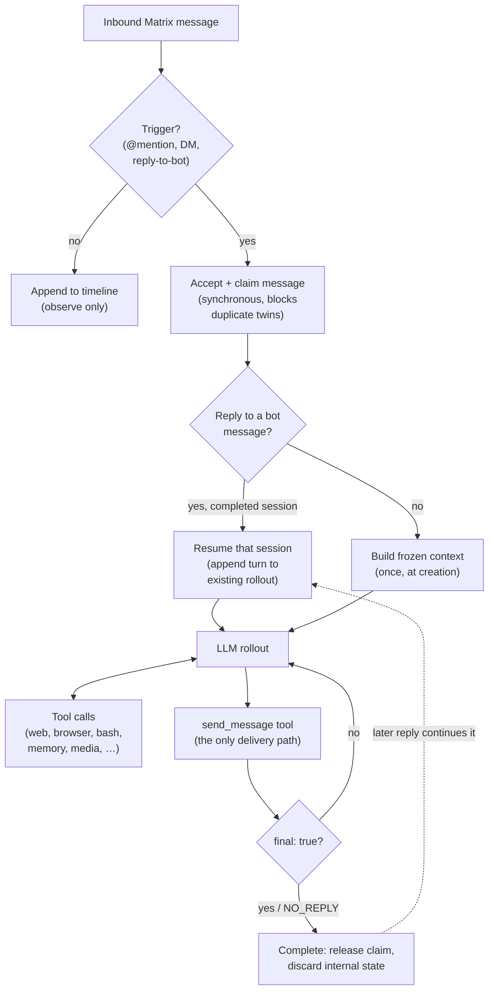
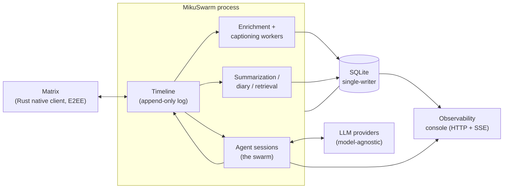

<p align="center">
  <picture>
    <source media="(prefers-color-scheme: dark)" srcset="docs/title-dark.svg">
    
  </picture>
</p>

**A self-hosted agent that lives in your Matrix rooms as one of the members: anyone can @ it, and it answers with a real browser and a shell sandbox of its own. Underneath is a harness built for group chats: the chatroom is the database, and every reply runs as its own parallel, disposable agent session.**

<p align="center">
  <picture>
    <source media="(prefers-color-scheme: dark)" srcset="docs/harness-dark.svg">
    
  </picture>
</p>

MikuSwarm is built around one inversion: the conversation is not the agent's session. The chat lives in its own database, ingested verbatim and summarized continuously whether or not the agent is doing anything. Every time the bot is triggered, a fresh agent session spins up with context assembled from that log, works in parallel with any other sessions, says what it has to say through an explicit send tool, and is thrown away; its thinking, tool calls, and dead ends never enter the room's history. That is the part you cannot get by pointing an existing agent at a chatroom, and it is what makes a heavyweight, fully-tooled agent viable as one member of a busy room.

The reason to want such an agent in a room at all comes from two places. OpenClaw and similar agents showed that an agent gets dramatically more useful when it lives in your messaging apps and owns a real computer (a browser, a shell, files, a schedule, a persistent identity) instead of being a chat window that only talks. @grok on X showed what happens when an agent is *public*: anyone can summon it mid-conversation to fact-check a claim, research a question, settle an argument as a neutral third party, or edit an image someone just posted, and the whole exchange lands in front of everyone, which changes what an agent is for. MikuSwarm is the combination: the first kind of toolkit doing the second kind of job, on a harness actually shaped for the room it lives in.

Concretely: the bot sits in your rooms and reads everything, like any other member. Mention it, reply to it, or DM it, and it answers, putting real work behind the answer when it needs to: web search, a stealth browser with its own persistent logins, a Docker shell sandbox it has free rein over, file editing, image generation, media analysis, remote MCP servers. It indexes the full message history of every room (and can backfill from before it joined), so it can dig up a conversation from four months ago, tell a moderator what someone usually posts about and when they joined, or recap what you missed while you were away. Background workers keep summarizing the chat and writing its first-person diary even while nobody is talking to it, so it knows what the room did last week, including the parts it was never asked about. And it plays a persona: people ask its opinion, argue with it, and treat it as one of the regulars. As far as its own context is concerned, that is what it is.

Everything runs on your own infrastructure against whatever models you configure. The shipped persona is a neutral, replaceable default, and the niche add-ons (danbooru search, character cards, reverse-image lookup, X search) are off by default. One thing to be clear-eyed about: this is a public agent in a shared space. Anyone in the room can prompt it, and anything it can read you should assume the room can get out of it, the same deal @grok offers. Don't feed it secrets you wouldn't post in the channel.

---

## Why a group chat needs a different harness

The obvious way to build this is to point an existing OpenClaw-alike at a group chat. It fails in instructive ways, because that family of harnesses makes two assumptions a group chat breaks.

First, they are single-owner by design. The security model pairs the agent to its owner's accounts and confines it to DMs by default, which is reasonable for something that operates the owner's computer. Running one in a room full of other people means switching every one of those protections off and hoping the sandbox holds.

Second, and deeper: they treat the conversation as the agent session. There is one continuous user/assistant rollout per channel, and chat messages arrive inside it as metadata-wrapped user turns; nothing in the harness knows what a chatroom is. The consequences compound. Every message drags its JSON wrapper through the context window for as long as it stays in history. The channel serializes, because the running session *is* the channel: the agent cannot answer two people at once. And one hard question (a hundred browser tool calls, thinking blocks, failed retries) leaves its debris sitting in the middle of the conversation until compaction finally eats it, pushing the actual chat further and further away.

A group chat needs the opposite premise: **the conversation is not the session.** A room moves on its own, most of what happens there has nothing to do with the agent, and the agent has to work as one participant among many.

So MikuSwarm is chat-first, as described at the top: the chatlog (the bot's own messages included) is the durable thing, and sessions are disposable readers and writers of it. Several consequences fall out. Summarization runs against the log continuously, so compaction is never something a reply has to wait for. Raw model output never reaches the room; only explicit `send_message` calls do, which also means models that leak thinking into their responses stay contained. Every trigger is an independent, parallel session over one shared history, which is the swarm in the name. And however much work an answer took, the messages the session chose to send are its only artifact: the room's history stays clean, and a slow research dig for one person never blocks a quick answer for another.

The honest trade-off: sessions are normally one rollout. Replying to a bot message resumes the session that produced it when there is real state to carry forward, but long, iterative, session-continuous work like pair-programming with the room bot is deliberately out of scope. In exchange, the usage pattern a public chat agent actually sees, where the answer is the product, maps perfectly onto one session per question.

---

## The swarm: a parallel session harness

The architecture rests on three deliberately decoupled ideas:

1. **A timeline**: a continuously growing, append-only event log per chat context (room, DM, thread). It observes the conversation the way any room participant would, regardless of whether the bot is "doing" anything.
2. **Agent sessions**: ephemeral agent instances spawned in response to triggers. Each reads the timeline, does work, sends messages, and then terminates. Conversational state lives entirely in the timeline and the short-lived sessions that read from and write to it; no persistent agent process sits in between.
3. **Context assembly**: a deterministic pipeline that turns the timeline into token-budgeted, structured LLM context for each session.

Because every trigger gets its own session, many can run at once. The interesting engineering is in keeping them from stepping on each other. The coordination layer includes:

- **A priority LLM request scheduler.** A self-hosted deployment usually shares one scarce upstream rate budget across *everything*: live replies, background summarization, diary writing, image generation. Left uncoordinated, a background job grabs the slot a live reply needs. The scheduler is a process-wide admission gate: requests queue by **class** (live chat outranks proactive posts, which outrank summarization, which outranks diary), with shallow bounded in-flight counts so prioritization is actually meaningful against a FIFO upstream. It also tracks per-model health with half-open probing, honours `Retry-After`, and transparently fails over across configured fallback models.
- **Session claims (no duplicate replies).** When a session is triggered it *claims* the message that triggered it, synchronously, the instant it is accepted. A second near-simultaneous trigger for the same message sees that claim and declines to spawn a twin. The claim drives a render-time "another session is handling this" marker and a live guard at send time, closing both the "two users reacted at once" and the "I cross-replied to something another session owns" failure modes.
- **Co-target coalescing.** Two people replying to the *same* message within a short window are folded into one session as interjections rather than spawning duplicate answers.
- **Follow-up folding.** A quick same-sender follow-up (the image that arrives just after `@miku look at this`, or a `@miku actually, London` correction) is folded into the session its predecessor produced, instead of being lost or answered half-blind. Depending on timing it steers into a running session, parks until it goes live, or resumes a just-completed one.
- **Resumable sessions.** Replying to a message the bot sent **continues the session that produced it**, appending your reply as a new turn on the same rollout, so a multi-step task (a browser session, a research dig) carries its state forward instead of restarting amnesiac. A single-consumption guard keeps resumes linear, and a "work gate" ensures only genuinely stateful sessions resume.

Each concurrent session sees the timeline as it stood when it started, is told about the other active sessions, shares no mutable state, and delivers messages that immediately appear on the timeline for its siblings to see.

This is also why there is no subagent mechanic: every session already is one, in effect. A question that takes a hundred tool calls runs in its own parallel rollout without stalling anything else, and the session keeps the full chat context that a spawned subagent would lack. For the kinds of requests a room actually makes, seeing the whole conversation usually matters more than delegation.

---

## How it works

### Context assembly

Each session's prompt is **built once, at creation, and is append-only thereafter**, never rebuilt per turn. That makes the prefix byte-stable (cache-friendly), coherent (the session sees the world as it was when it started), and a clean base for persistence and resume. The build is a deterministic, token-budgeted, tiered layout:



As raw events age out of the rich and compact tiers they are absorbed into the summary layer instead of being dropped; the volatile, cache-cheap final turn carries everything session-specific (the triggering messages, current runtime state, any auto-retrieved memory). See [ARCHITECTURE.md §9 / §9a](ARCHITECTURE.md).

### Session lifecycle



Sessions never deliver text implicitly: every message goes through the `send_message` tool, and the model's raw output is treated as private scratchpad. A turn ends only on an explicit `final: true` send or the literal `NO_REPLY` (intentional silence). See [ARCHITECTURE.md §8](ARCHITECTURE.md).

Most triggers are human: a mention, a reply to the bot, a DM. With the opt-in proactive scheduler the bot can also open sessions on its own cadence and decide for itself whether the room warrants an unprompted post, which gives it a bit of a life of its own.

### Memory

The bot is not write-only or goldfish-brained. Four cooperating subsystems give it real recall:

- **Hierarchical summarization**: aging history is condensed into multi-level summaries (summaries of summaries, unlimited depth), produced by background sessions sharing the persona.
- **First-person diary**: a background worker journals what happened, in the bot's own voice, so recent memory reads naturally back into context.
- **Hybrid retrieval**: semantic + keyword (BM25) search over the bot's memory files, with temporal decay; relevant memories are auto-retrieved into the final turn (cache-free) or fetched on demand via a tool.
- **Chat-history search & recap**: full-text search over the actual message history across rooms, plus a "what did I miss" recap that detects an absence gap and returns the finest available summaries for it.

See [ARCHITECTURE.md §9b–§9e](ARCHITECTURE.md).

### Enrichment & captioning

Persisted events are enriched out of band: attachments and linked media are downloaded, replies resolved, link previews fetched, X.com posts expanded. A separate caption worker pool describes images, video, and audio with a multimodal model (animated images are converted to short video clips first). Context build waits only as long as it must for the readiness it needs. See [ARCHITECTURE.md §7a](ARCHITECTURE.md).

### Tools

The toolkit is aimed at letting the bot do the same things the humans in the room can do from their own computers: look something up, poke at a website, run code, post an image. Up to ~39 tools are available to a chat session: chat actions (`send_message`, `react`, `edit_message`, polls, pins, profile), web search/fetch, a **real stealth browser** (one persistent identity with shared cookies/logins, driven via an accessibility snapshot), a **Docker shell sandbox** for `bash`/`search_files`, file editing in a sandboxed workspace, media analysis, image generation, memory read/write, and remote **MCP** servers (the default ships keyless Exa web tools, no API key needed). Niche add-ons (`danbooru`, character cards, SauceNAO reverse-image lookup, X search) are gated off by default. See [ARCHITECTURE.md §10 / §11a / §11b](ARCHITECTURE.md).

### Cost & budget limits

Spend is bounded at three levels: a **per-session** USD ceiling (with a soft agent-facing warning before a hard cutoff), **period** limits (rolling/calendar windows over a unified usage ledger), and **per-user** limits with per-user model selection. Token usage comes from the providers' own usage reports rather than local estimates. See [ARCHITECTURE.md §8d–§8g](ARCHITECTURE.md).

### Observability console

An optional in-process HTTP + SSE console exposes the bot's internals: the durable record of every session (frozen context snapshot + full transcript), a live stream of a running session's events (including tentative tokens during inference retries), the LLM scheduler's state, and a preview of exactly what context the *next* session in any room would build. It is read-only except for a few operator actions (stop / resume / retry). See [ARCHITECTURE.md §11](ARCHITECTURE.md).

### Native Rust Matrix module

The Matrix transport is a Rust NAPI module built on `matrix-sdk`, handling end-to-end encryption, media download/decryption, custom emoji, and link previews. The TypeScript side is the sole formatter of agent-facing timestamps, so the host's real timezone never leaks. See [ARCHITECTURE.md §6](ARCHITECTURE.md).

### Putting it together



---

## Quickstart

MikuSwarm ships as Docker images on GHCR. Pick a compose file, fill in `.env`, and bring it up.

1. **Choose a compose file:**
   - `docker-compose.yml`: the **full hardened stack** (agent + console + egress firewall + browser Manager + sandbox), pulled from published images. This is the default, canonical deployment. (To build the images from source instead, use `docker-compose.dev.yml`.)
   - `docker-compose.minimal.yml`: **agent + console only**. The simplest "copy + `.env` + up", with reduced isolation (no firewall, no browser, no sandbox; the app-layer SSRF guard is re-enabled in its place, and `bash`/`search_files`/`browser` tools are unavailable).

2. **Configure the environment:**
   ```bash
   cp .env.example .env
   # then edit .env
   ```
   Required vars include your Matrix login, the LLM API base URLs + key, a console token, the host `MIKUSWARM_UID`/`MIKUSWARM_GID` (and `DOCKER_GID` for the full stack), and `MIKUSWARM_IMAGE_PREFIX` (set to **your** GitHub owner; images are pulled from `ghcr.io/<owner>/mikuswarm-agent`, `-console`, `-egress`, `-sandbox`). The config loader **fails fast** if any referenced variable is missing. See the comments in [`.env.example`](.env.example) for the exact set.

3. **Bring it up:**
   ```bash
   docker compose up -d
   # or: docker compose -f docker-compose.minimal.yml up -d
   ```
   On first run, **seeding** auto-populates an empty config directory and an empty workspace from the committed `templates/` tree (copy-missing, never-overwrite, so it can never clobber an established deployment). The bot can then boot.

4. **Open the console** at `http://127.0.0.1:5173` (or your configured origin) to watch sessions live.

5. **Personalize the persona** by editing `workspace/SOUL.md` (the bot's character), along with `AGENTS.md` / `TOOLS.md` / `TAIL.md`. The shipped persona is a neutral, replaceable default.

---

## Configuration

Configuration is **TOML**, loaded from a `config/` directory in lexicographic filename order and deep-merged, with `${ENV_VAR}` substitution and TypeBox schema validation (logs redact secrets automatically). Ship defaults in `00-defaults.toml`; put your deployment's choices in local overrides.

- **`[features]`** gates the niche add-on tool groups (`character_card`, `danbooru`), off by default; turning one on also seeds its skill files.
- **`[models.*]`** declares models, rate-limit groups, fallback chains, and per-model knobs; consumers reference models by name so virtual models and fallback apply uniformly.
- **Budgets** live in `[[limits]]`, per-session ceilings, and per-user limits.

See [ARCHITECTURE.md §4](ARCHITECTURE.md) for the full schema and merge semantics.

---

## Project layout

```
src/
  timeline/        Append-only event log, routing, trigger coordination
  agent/           Session factory/runner/manager, LLM scheduler, retry & resume
  context/         Deterministic context builder, renderer, compaction
  enrichment/      Download/link-preview/reply-resolution worker pool
  captioning/      Image/video/audio caption worker pool
  summarization/   Hierarchical rolling summaries
  diary/           First-person journal memory
  retrieval/       Hybrid (semantic + BM25) memory search
  search/          Chat-history FTS search & recap
  proactive/       Self-initiated posting (opt-in)
  budget/          Period / session / per-user cost limits
  tools/           Agent tool implementations
  sandbox/         Docker shell sandbox
  browser/         Stealth browser-use control layer
  matrix/          Matrix provider + native client wrapper
  storage/         SQLite (single-writer queue)
  observability/   Structured logging, context dumps, console API
native/            Rust NAPI module (matrix-sdk, E2EE, media, previews)
console/           SvelteKit observability console (separate process)
config/            TOML config directory (lexicographic merge)
templates/         First-run seed: config + workspace + feature skills
docker/            Sandbox + browser images & lifecycle scripts
```

**[ARCHITECTURE.md](ARCHITECTURE.md)** is the deep reference: data flow, invariants, context assembly, the enrichment pipeline, the full configuration schema, and the rationale behind every design decision.

---

## Contributing

Contributions are welcome. See [CONTRIBUTING.md](CONTRIBUTING.md) for development setup, the type-check/test workflow, and conventions. In short: TypeScript runs directly via `tsx` (no build step; type-check with `tsc --noEmit`), tests use the Node test runner (`npm test`), and the Rust native module builds with `cargo`.

## License

MikuSwarm is licensed under the **GNU Affero General Public License v3.0** (AGPL-3.0). See [LICENSE](LICENSE).
